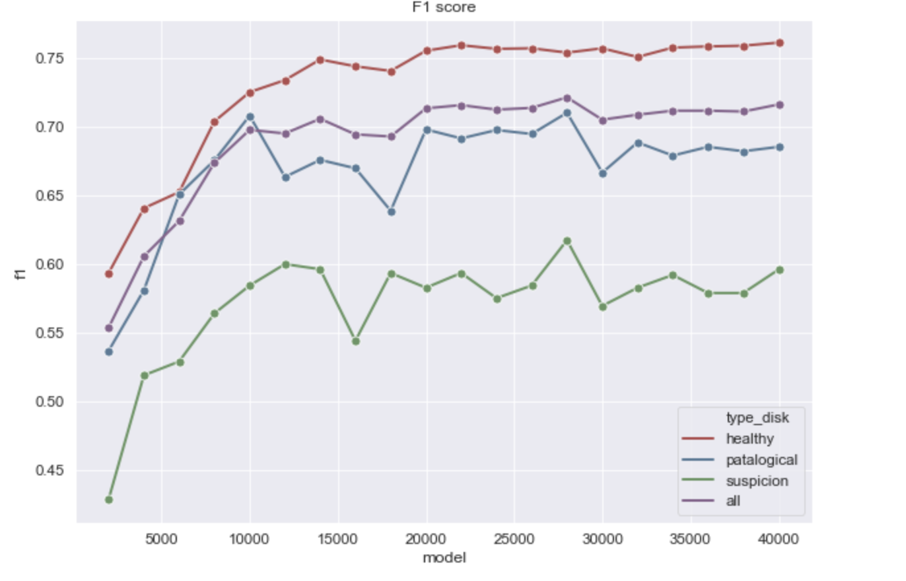

# MRI_yolo

Project for MRI detection with YOLO.

Data preprocessing, visualization and result in [Jupyter report](report.ipynb)

## 1. Structure

### Upload
* **[upload_utils](src/upload_utils.py):** main utils for download from GoogleDrive raw data and preprocessing data
* **[upload_yolo_utils](src/upload_yolo_utils.py):** utils for prepare our data for YOLO format:
	* copy `obj.data`, `obj.names` (you can see [data](cfg/obj.data), [names](cfg/obj.names)) to darknet workdir
	* copy `cfg` ([cfg](cfg/yolo.cfg)) to darknet workdir
	* copy images to darknet workdir
	* create `{img_name}.txt` for each image:
		```
		<object-class> <x_center> <y_center> <width> <height>
		```
	* More information: [Darknet README](https://github.com/AlexeyAB/darknet#how-to-train-to-detect-your-custom-objects)
* **[draw_utils](src/draw_utils.py):** functions for drawing images with box
* **[yolo_utils](src/yolo_utils.py):** load libdarknet (C-library) and detection functions
* **[YoloModels](src/yolo_models.py):** class of prediction for each model class and calculation of metrics
* **[YoloPredict](src/yolo.py):** class of prediction for one model
* **[YoloMetricsImgs](src/yolo_metrics_imgs.py):** class of calculation prediction for all images
* **[YoloMetricsImg](src/yolo_metrics_img.py):** class of calculation prediction for one image


## 2. Train

I use darknet YOLO for train our model. 

1. Clone project 


```bash
git clone https://github.com/AlexeyAB/darknet.git
cd darknet

```
2. We need change `Makefile`. I ran my model on Amazon (with GPU)

```
OPENV=1
GPU=1
LIBSO=1
```

3. Make

```bash
make

cp darknet build/darknet/x64/
```


4. Download weights and convert

```bash 

wget https://pjreddie.com/media/files/yolov2-tiny-voc.weights

./darknet partial cfg/yolo.cfg yolov2-tiny-voc.weights yolo.13 13
```

5. Run train and you can see results on `ec2-18-232-51-243.compute-1.amazonaws.com:8090` service (for example)

```bash
./darknet detector train data/obj.data cfg/yolo.cfg yolo.13 -dont_show -mjpeg_port 8090 -map
```

6. You can use this command for check results (metrics)

```
./darknet detector map data/obj.data cfg/yolo.cfg backup/yolo_final.weights
```

7. Output in `backup/{epoch}.weights`


## 3. Validation

More about metric:
 [1](https://medium.com/@jonathan_hui/map-mean-average-precision-for-object-detection-45c121a31173)
 [2](https://arxiv.org/pdf/1612.08242v1.pdf)
 [3](https://medium.com/@timothycarlen/understanding-the-map-evaluation-metric-for-object-detection-a07fe6962cf3)

1. We use **F1** and **mAP** metrics for testing our model. You can see results in [report](report.ipynb).




2. Example detect:


